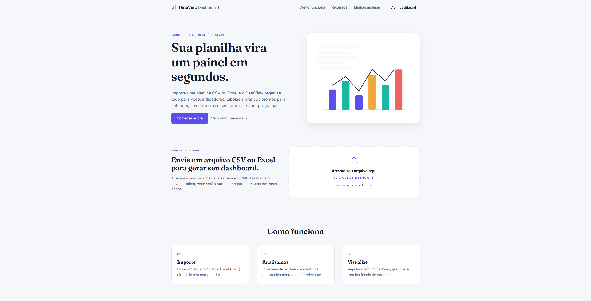
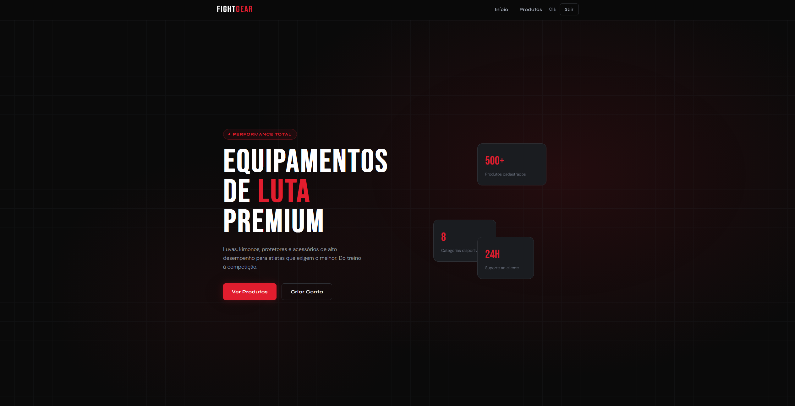
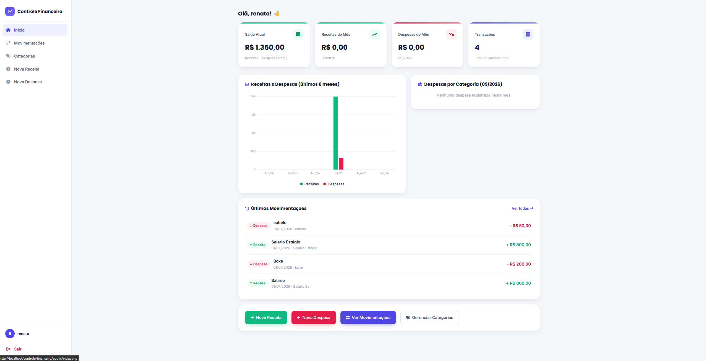

<h1 align="center">Olá, eu sou Renato</h1>

<h3 align="center"> Desenvolvedor | Estudante de Tecnologia</h3>

  

  
  
  
  

 

---

##  Sobre mim

> Olá! Meu nome é **Renato Aguiar**.
>
> Estou estudando **Análise e Desenvolvimento de Sistemas** e atualmente meu foco é o **desenvolvimento de software**.
> Sou estudante de Análise e Desenvolvimento de Sistemas e venho construindo minha jornada na área de tecnologia através de estudos e projetos próprios. Tenho interesse principalmente em desenvolvimento web e programação, buscando sempre aprender novas tecnologias e transformar o conhecimento em projetos práticos.
>Atualmente, venho aprofundando meus conhecimentos em Python, PHP, JavaScript, HTML, CSS e bancos de dados, além de explorar frameworks e ferramentas que possam me ajudar a evoluir como desenvolvedor. Meu objetivo é continuar aprendendo, desenvolver projetos cada vez melhores e crescer profissionalmente na área de tecnologia.

-  Atualmente estudando: **ADS - Análise e Desenvolvimento de Sistemas**
-  Aprendendo: **Php, Flask, Python, Bancos de Dados**
-  Fale comigo sobre: **Programação, Tecnologia, Jogos**
-  Curiosidade: **Entre códigos, projetos e estudos, também sou apaixonado por games. Gosto de conhecer novos jogos, enfrentar desafios e sempre tentar ir um pouco além — dentro e fora dos jogos.**

---

##  Tecnologias

### Linguagens

  
  
  
  
  

### Frameworks & Bibliotecas

  
  

### Banco de Dados

  

### Ferramentas & Versionamento

  
  

---

##  Projetos

### 🔹 Dartaview Daashboard

📌 **Descrição:** Dashboard financeiro desenvolvido em Python e Flask, com recursos para gerenciamento e visualização de dados, gráficos, indicadores e análises financeiras por meio de uma interface simples e intuitiva.

🛠️ **Tecnologias utilizadas:** `Python` `Flask` `SQL`

🔗 **Link:** https://github.com/R3H02/dataview-dashboard

 

### 🔹 Fight Geaar

📌 **Descrição:** O FightGear é um sistema de loja virtual voltado para produtos de artes marciais, desenvolvido com foco em praticidade e organização. O sistema possui dois tipos de login, permitindo diferentes níveis de acesso: um para clientes, que podem navegar e realizar compras, e outro para administradores, responsável pelo gerenciamento dos produtos e informações da loja.

O projeto também trabalha com banco de dados e operações CRUD, permitindo cadastrar, visualizar, editar e excluir informações de forma organizada.

🛠️ **Tecnologias utilizadas:** `PHP` `MySQL` `HTML/CSS`

🔗 **Link:** https://github.com/R3H02/fightgear

 

### 🔹 Controle Financeiro

📌 **Descrição:** O Controle Financeiro é um sistema desenvolvido para facilitar o gerenciamento das finanças pessoais. Ele permite registrar entradas e saídas de dinheiro, organizar movimentações por categorias e acompanhar a situação financeira de forma mais clara. O projeto também conta com gráficos e relatórios, ajudando a visualizar os gastos e o desempenho financeiro ao longo do tempo.

🛠️ **Tecnologias utilizadas:** `PHP` `MySQL` `HTML/CSS`

🔗 **Link:** https://github.com/R3H02/controle-financeiro

---

##  Estatísticas do GitHub

<!-- 

  
  

 -->

  

---

##  Contato

  
  
  
  

---

<h3 align="center"> Sempre aprendendo, sempre desenvolvendo.</h3>

